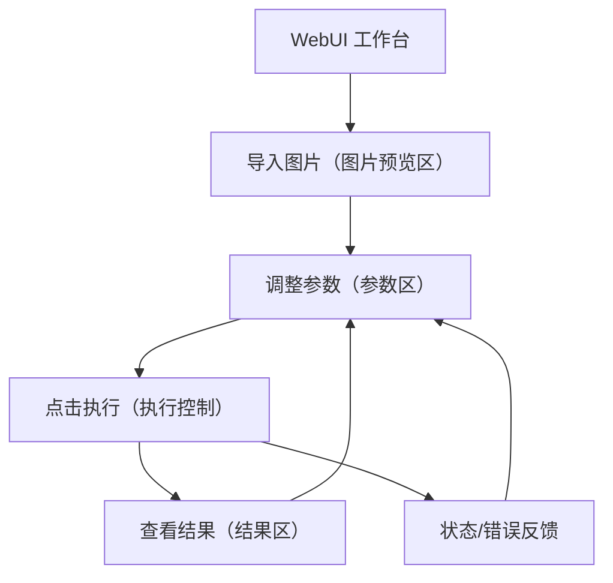

## 1. Product Overview
面向现有 WebUI 的视觉与交互规范化升级：极简科技风、低亮度护眼，并支持可选深色主题。
核心目标是让“图片预览 / 结果 / 参数”三大区域清晰分区，使用深蓝/深灰低饱和配色提升长时间使用舒适度。

## 2. Core Features

### 2.1 Feature Module
本 WebUI 需求由以下页面组成：
1. **WebUI 工作台**：顶部栏（标题/主题切换）、三分区主布局（图片预览、结果、参数）、执行与状态反馈。

### 2.2 Page Details
| Page Name | Module Name | Feature description |
|-----------|-------------|---------------------|
| WebUI 工作台 | 顶部导航栏 | 显示产品标题；提供主题切换（默认低亮度科技风 / 可选深色主题）。 |
| WebUI 工作台 | 三分区主布局 | 以清晰边界与一致间距组织“图片预览 / 结果 / 参数”三区；保持低干扰信息密度。 |
| WebUI 工作台 | 图片预览区 | 导入/替换图片并预览；支持基础查看（适配容器、滚动与放大查看的入口/控件）。 |
| WebUI 工作台 | 参数区 | 展示并编辑必要参数；按逻辑分组与折叠（减少视觉负担）；提供一键恢复默认参数。 |
| WebUI 工作台 | 执行控制 | 提供主按钮触发处理/生成；在执行中禁用重复提交；支持取消/停止（若现有能力支持）。 |
| WebUI 工作台 | 结果区 | 展示处理/生成结果；支持对比查看（与预览图的并排/切换）；提供下载/复制等导出动作（若现有能力支持）。 |
| WebUI 工作台 | 状态与错误反馈 | 显示执行进度/耗时/成功提示；在失败时给出简明错误信息与重试入口。 |

## 3. Core Process
- 你进入 WebUI 工作台，默认使用低亮度的深蓝/深灰科技风主题。
- 你在“图片预览区”导入图片，系统显示预览。
- 你在“参数区”按分组调整参数，必要时可一键恢复默认。
- 你点击“执行”开始处理/生成；系统在顶部或结果区展示执行状态与进度。
- 你在“结果区”查看输出结果，并与预览图进行对比查看；如需要可导出结果。
- 若执行失败，你查看错误原因并重试。

