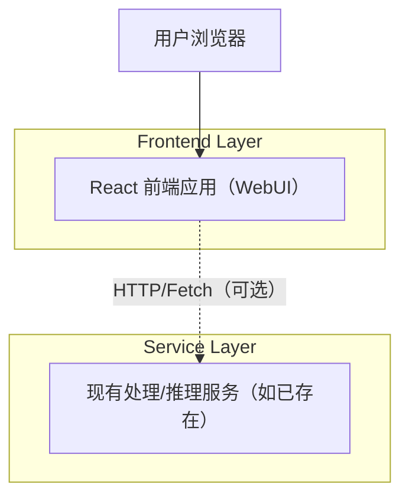

## 1.Architecture design

## 2.Technology Description
- Frontend: React@18 + vite + tailwindcss（或等价的 CSS 方案，用于快速落地低亮度主题与三分区布局）
- Backend: None（若你的现有系统已经提供处理/推理接口，则由前端直接调用；本文不新增后端职责）

## 3.Route definitions
| Route | Purpose |
|-------|---------|
| / | WebUI 工作台：主题切换、图片预览/结果/参数三分区、执行与状态反馈 |
